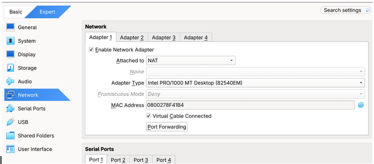
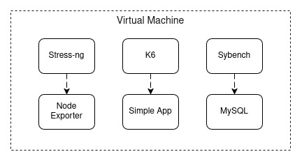

**🔥 HANDS-ON Monitoring & Observability**  
--

<div align="center">
  
</div>

## 1. Teori Singkat

1. Simple-App

Aplikasi penerima **HTTP Request** dan memuat **library Prometheus** yang dapat terhubung langsung ke prometheus dan mengirim metrics. Aplikasi ini terhubung ke MySQL untuk menyimpan endpoint jumlah akses user.  
Default port: 5000.

2. Prometheus

Prometheus merupakan alat/software monitoring dan observability yang bersifat Open Source. Software ini bekerja dengan **mengambil** hasil data metric monitoring dari setiap **exporter** maupun software yang mendukung library prometheus. Di praktik ini, Prometheus akan mengumpulkan data dari Simple-App dan MySQL Exporter.  
Default Port: 9090.

3. Exporter

Exporter merupakan software monitoring yang **wajib** digunakan ketika ingin menggunakan Prometheus. Exporter bekerja dengan mengambil data metric monitoring secara langsung di server atau di software, dan akan mengubah nilai data metric menjadi format Prometheus. Di praktik ini, Exporter akan mengambil metric secara langsung dari software MySQL dan mengambil metric secara langsung ke penggunaan resource hardware dari VM.  
Default Port: 9104.

4. Promtail

Promtail merupakan software untuk **membaca log** dari aplikasi atau sistem secara real time dan **mengirimkan log** tersebut ke loki. Promtail disebut sebagai log agent atau “kurir”. Sebelum mengirim ke loki, promtail akan memberi label setiap log. Label tersebut memuat seperti nama aplikasi, nama kontainer, dll. Dalam praktik ini, Promtail akan membaca log dari docker berdasarkan kontainer.  
Default Port: 9080.

5. Loki

Loki merupakan software tempat **menyimpan log** dari log agent. Loki akan menerima logging dari log agent dan menyimpan selama batas waktu tertentu. Proses filtering data disebut LogQL dengan labeling yang dimuat oleh log agent.  
Default Port: 3100.

6. Grafana

Grafana merupakan software **visualisasi** dashboard yang dapat memuat grafik dengan cara menghubungkan ke sumber pengambil data yaitu Prometheus, Loki, dll. 
Default Port: 3000.

7. K6 Testing Tool

Software untuk memberi **load traffic request** dengan tujuan menguji ketahanan aplikasi.

8. Sysbench Testing Tool

Software untuk memberi **load query** ke database dengan tujuan menguji ketahanan database.


## 2. Hands-On Monitoring & Observability 

💥 SETUP Di Virtual Machine

1. Siapkan VM anda, gunakan OS yang sudah terinstal di inkubasi sebelumnya.

2. Agar VM anda bisa diakses dari local laptop anda via CLI, Kita perlu menggunakan protokol SSH. Lakukan instalasi openssh-server di CLI VM anda.

``` 
sudo apt instal openssh-server -y 
```

3. Dikarenakan IP VM berada di belakang NAT milik hypervisor, kita perlu melakukan port forwarding untuk membuka port pada VM agar terhubung langsung dengan port localhost. 

Klik bagian **Settings** ➡️ **Expert** ➡️ **Network** ➡️ **Port Forwarding**.

<div align="center">
  
</div>

Di dalam port forwarding ada tabel: 

| Name    | Protocol | Host IP | Host Port | Guest IP | Guest Port |
| :--------| :---------| :--------| :----------| :---------| :-----------|
| SSH     | tcp      |         | 2222      |          | 22         |
| Grafana | tcp      |         | 3000      |          | 3000       |

Isi bagian **Name** menyesuaikan, bagian **Protocol** berisi tcp, **Host IP** (dikarenakan IP local milik host, maka dikosongkan), bagian **Host Port** isi dengan port yang unik (agar tidak bentrok), bagian **Guest IP** (dikarenakan IP local milik VM, maka dikosongkan), bagian **Guest Port** sebaiknya isi sesuai dengan default port software atau protocol tersebut.

4. Lakukan SSH ke VM melalui CLI (Terminal/PowerShell) kalian.

```
ssh <USER>@localhost -p 2222
```

* [**INFO**]  isi `<USER>` nama user vm anda.  
* [**INFO**] Jika windows anda tidak support SSH, anda bisa menggunakan WSL.

5. Setelah VM aktif, lakukan instalasi docker menggunakan CLI (jika belum).

Link dokumentasi: [https://docs.docker.com/engine/install/](https://docs.docker.com/engine/install/) 

6. Jalankan daemon docker (pastikan running).

```
sudo systemctl start docker

# Check sudah running atau belum.
sudo systemctl status docker
```

* [**INFO**] **Daemon** adalah sistem latar belakang linux untuk menjalankan software basis CLI.

7. Agar file konfigurasi mudah di maintenance, nantinya kita akan buat sebuah root direktori dan buat direktori untuk masing-masing konfigurasi.

```
└── hands-on/ 
   ├── docker-compose.yml     
   ├── docker-compose.testing.yml     
   ├── prometheus/     
   │   └── prometheus.yml     
   ├── loki/     
   │   └── loki.yml     
   ├── promtail/     
   │   └── promtail.yml     
   ├── simple-app/     
   │   ├── app.py     
   │   ├── Dockerfile     
   │   └── requirements.txt     
   └── script/         
       └── k6-script.js 
```

* [**INFO**] Anda bisa setup konfigurasi ini di VSCode di dalam VM anda atau pakai Vim/Nano di CLI. 
* [**INFO**] Ingat, Gunakan perintah `mkdir` untuk membuat direktori dan gunakan perintah `nano` untuk membuat file sekaligus isinya. 
* [**INFO**] Lakukanlah bertahap, mulai dari setup simple-app hingga setup docker-compose untuk menjalankan semua software dalam bentuk kontainer satu file dan satu network di docker-compose.yml.
* [**INFO**] Ingat, file yaml harus memerhatikan indentasi (aturan spasi).

8. Buat sebuah simple-app code berikut di dalam VM anda, beserta Dockerfile dan dependensinya.

Kode simple-app.py
```
import os
import time
import random
import logging
import mysql.connector
from flask import Flask, jsonify, request
from prometheus_client import Counter, Histogram, Gauge, generate_latest, CONTENT_TYPE_LATEST

logging.basicConfig(
    level=logging.INFO,
    format='%(asctime)s [%(levelname)s] %(message)s'
)
logger = logging.getLogger(__name__)

app = Flask(__name__)

REQUEST_COUNT = Counter(
    'app_request_total',
    'Total HTTP requests',
    ['method', 'endpoint', 'status']
)
REQUEST_LATENCY = Histogram(
    'app_request_duration_seconds',
    'HTTP request duration',
    ['endpoint']
)
DB_QUERY_COUNT = Counter(
    'app_db_query_total',
    'Total DB queries',
    ['operation', 'status']
)
ACTIVE_USERS = Gauge(
    'app_active_users',
    'Simulated active users'
)

def get_db():
    return mysql.connector.connect(
        host=os.getenv('MYSQL_HOST', 'mysql'),
        user=os.getenv('MYSQL_USER', 'appuser'),
        password=os.getenv('MYSQL_PASSWORD', 'apppassword'),
        database=os.getenv('MYSQL_DATABASE', 'appdb')
    )

def init_db():
    for attempt in range(10):
        try:
            conn = get_db()
            cur = conn.cursor()
            cur.execute("""
                CREATE TABLE IF NOT EXISTS visits (
                    id INT AUTO_INCREMENT PRIMARY KEY,
                    path VARCHAR(255),
                    visited_at TIMESTAMP DEFAULT CURRENT_TIMESTAMP
                )
            """)
            conn.commit()
            cur.close(); conn.close()
            logger.info("Database initialized successfully")
            return
        except Exception as e:
            logger.warning(f"DB not ready (attempt {attempt+1}/10): {e}")
            time.sleep(3)
    logger.error("Failed to initialize database after 10 attempts")

@app.route('/')
def index():
    start = time.time()
    try:
        conn = get_db()
        cur = conn.cursor()
        cur.execute("INSERT INTO visits (path) VALUES (%s)", (request.path,))
        conn.commit()
        cur.execute("SELECT COUNT(*) FROM visits")
        count = cur.fetchone()[0]
        cur.close(); conn.close()

        ACTIVE_USERS.set(random.randint(5, 50))
        DB_QUERY_COUNT.labels(operation='insert', status='success').inc()
        REQUEST_COUNT.labels(method='GET', endpoint='/', status='200').inc()
        logger.info(f"GET / — total visits: {count}")
        return jsonify({"message": "Hello from Flask App!", "total_visits": count})
    except Exception as e:
        DB_QUERY_COUNT.labels(operation='insert', status='error').inc()
        REQUEST_COUNT.labels(method='GET', endpoint='/', status='500').inc()
        logger.error(f"Error on GET /: {e}")
        return jsonify({"error": str(e)}), 500
    finally:
        REQUEST_LATENCY.labels(endpoint='/').observe(time.time() - start)

@app.route('/slow')
def slow():
    start = time.time()
    delay = random.uniform(0.5, 3.0)
    time.sleep(delay)
    REQUEST_COUNT.labels(method='GET', endpoint='/slow', status='200').inc()
    REQUEST_LATENCY.labels(endpoint='/slow').observe(time.time() - start)
    logger.warning(f"GET /slow — took {delay:.2f}s")
    return jsonify({"message": "This was a slow response", "delay_seconds": round(delay, 2)})

@app.route('/error')
def error():
    REQUEST_COUNT.labels(method='GET', endpoint='/error', status='500').inc()
    logger.error("GET /error — simulated error triggered")
    return jsonify({"error": "Simulated internal server error"}), 500

@app.route('/health')
def health():
    return jsonify({"status": "ok"})

@app.route('/metrics')
def metrics():
    return generate_latest(), 200, {'Content-Type': CONTENT_TYPE_LATEST}

if __name__ == '__main__':
    init_db()
    app.run(host='0.0.0.0', port=5000)

```

Kode Dockerfile.
```
FROM python:3.11-slim AS builder

WORKDIR /install

COPY requirements.txt .

RUN pip install --upgrade pip \
 && pip install \
      --target=/install/packages \
      --no-cache-dir \
      -r requirements.txt


FROM python:3.11-alpine AS runtime

RUN apk add --no-cache libstdc++


COPY --from=builder /install/packages /usr/local/lib/python3.11/site-packages

WORKDIR /app
COPY app.py .

RUN adduser -D appuser
USER appuser

EXPOSE 5000

CMD ["python", "app.py"]
```

Isi requirements.txt.

```
flask==3.1.0
mysql-connector-python==9.2.0
prometheus-client==0.21.1
```

* [**INFO**] Untuk build image simple-app, lakukan perintah `docker build -t simple-app:v1.0`.

9. Buat sebuah konfigurasi prometheus di prometheus.yml

```
global:
  scrape_interval: 5s
  evaluation_interval: 5s

scrape_configs:
  - job_name: 'prometheus'
    static_configs:
      - targets: ['localhost:9090']
  
  - job_name: 'node-exporter'
    static_configs:
      - targets: ['node-exporter:9100']
  
  - job_name: 'mysql'
    static_configs:
      - targets: ['mysql-exporter:9104']

  - job_name: 'simple-app'
    static_configs:
      - targets: ['simple-app:5000']
    metrics_path: '/metrics'

```

10. Buat sebuah konfigurasi promtail di promtail.yml

```
server:
  http_listen_port: 9080
  grpc_listen_port: 0

positions:
  filename: /tmp/positions.yaml

clients:
  - url: http://loki:3100/loki/api/v1/push

scrape_configs:

  - job_name: docker-containers
    docker_sd_configs:
      - host: unix:///var/run/docker.sock
        refresh_interval: 5s
    relabel_configs:
      - source_labels: ['__meta_docker_container_name']
        regex: '/(.*)'
        target_label: 'container'

  - job_name: syslog
    static_configs:
      - targets: ['localhost']
        labels:
          job: syslog
          host: vm-ubuntu
          __path__: /var/log/syslog

```

11. Buat sebuah konfigurasi loki di loki.yml

```
auth_enabled: false

server:
  http_listen_port: 3100

common:
  path_prefix: /loki
  storage:
    filesystem:
      chunks_directory: /loki/chunks
      rules_directory: /loki/rules
  replication_factor: 1
  ring:
    instance_addr: 127.0.0.1
    kvstore:
      store: inmemory

schema_config:
  configs:
    - from: 2025-03-01
      store: tsdb
      object_store: filesystem
      schema: v13
      index:
        prefix: index_
        period: 24h

limits_config:
  reject_old_samples: false

```

12. Selanjutnya, Buat sebuah docker-compose.yml yang memuat kontainer dari software tersebut agar berjalan dalam satu network dan bisa dijalankan dengan satu perintah.

```
services:

  mysql:
    image: mysql:5.7
    container_name: mysql
    restart: unless-stopped
    environment:
      MYSQL_ROOT_PASSWORD: rootpassword
      MYSQL_DATABASE: appdb
      MYSQL_USER: appuser
      MYSQL_PASSWORD: apppassword
    volumes:
      - mysql-data:/var/lib/mysql
    ports:
      - "3306:3306"
    networks:
      - monitoring

  simple-app:
    image: simple-app:v1.0
    container_name: simple-app
    restart: unless-stopped
    environment:
      MYSQL_HOST: mysql
      MYSQL_USER: appuser
      MYSQL_PASSWORD: apppassword
      MYSQL_DATABASE: appdb
    ports:
      - "5000:5000"
    depends_on:
      - mysql
    networks:
      - monitoring

  mysql-exporter:
    image: prom/mysqld-exporter:v0.18.0
    container_name: mysql-exporter
    restart: unless-stopped
    command:
      - "--mysqld.address=mysql:3306"
      - "--mysqld.username=appuser:apppassword"
    ports:
      - "9104:9104"
    depends_on:
      - mysql
    networks:
      - monitoring

  node-exporter:
    image: prom/node-exporter:v1.10.1
    container_name: node-exporter
    restart: unless-stopped
    volumes:
      - /proc:/host/proc:ro
      - /sys:/host/sys:ro
      - /:/rootfs:ro
    command:
      - '--path.procfs=/host/proc'
      - '--path.sysfs=/host/sys'
      - '--collector.filesystem.mount-points-exclude=^/(sys|proc|dev|host|etc)($$|/)'
    ports:
      - "9100:9100"
    networks:
      - monitoring

  prometheus:
    image: prom/prometheus:v3.10.0
    container_name: prometheus
    restart: unless-stopped
    volumes:
      - ./prometheus/prometheus.yml:/etc/prometheus/prometheus.yml
      - prometheus-data:/prometheus
    command:
      - '--config.file=/etc/prometheus/prometheus.yml'
      - '--storage.tsdb.path=/prometheus'
    ports:
      - "9090:9090"
    networks:
      - monitoring

  loki:
    image: grafana/loki:latest
    container_name: loki
    restart: unless-stopped
    volumes:
      - ./loki/loki.yml:/etc/loki/loki.yml
      - loki-data:/loki
    command: -config.file=/etc/loki/loki.yml
    ports:
      - "3100:3100"
    networks:
      - monitoring

  promtail:
    image: grafana/promtail:latest
    container_name: promtail
    restart: unless-stopped
    volumes:
      - ./promtail/promtail.yml:/etc/promtail/promtail.yml
      - /var/run/docker.sock:/var/run/docker.sock
      - /var/log:/var/log:ro
    command: -config.file=/etc/promtail/promtail.yml
    depends_on:
      - loki
    networks:
      - monitoring

  grafana:
    image: grafana/grafana:latest
    container_name: grafana
    restart: unless-stopped
    volumes:
    - grafana-data:/var/lib/grafana
    ports:
    - "3000:3000"
    networks:
    - monitoring

networks:
  monitoring:
    name: monitoring

volumes:
  mysql-data:
  prometheus-data:
  loki-data:
  grafana-data:

```

* [**INFO**] Untuk value kredensial, sebaiknya buat dan gunakan file “**.env**” yang berisi “**key: value**” untuk nantinya akan dimasukkan ke dalam docker-compose.yml. Hal ini dengan tujuan value tersebut tidak terekspos secara langsung di konfigurasi docker.
* [**INFO**] Jika tidak bisa auto pull image saat compose up, Lakukan Pull Image satu per satu.

13. Jalankan docker-compose.yml dan pastikan semua kontainer running.

``` docker compose up -d ```

14. Lakukan uji koneksi kontainer prometheus (Di VM)

Buka browser di VM: [http://localhost:9090/targets](http://localhost:9090/targets) 

atau via CLI:
```
curl -s http://localhost:9090/api/v1/targets | jq \\ '.data.activeTargets\[\] | {job: .labels.job, instance: .instance, health: .health}'
```
15. Setup kontainer di VM sudah selesai. Sekarang akses Grafana di lokal lewat port forwarding yang sudah diset.

Akses Grafana via Browser sesuai dengan portnya di **lokal**. (Jika bentrok atau tidak bisa diakses, coba ganti Host Port).

[http://localhost:3000](http://localhost:3000)

🚨 SETUP Grafana

1. Setelah akses ke browser, login ke Grafana dengan username “**admin**” dan password “**admin**”. Anda bisa mengubah passwordnya (opsional).  
 
2. Bagian panel sebelah kiri, Cari bagian “**Data Sources**”.

* [**INFO**] Data Source pada Grafana berfungsi untuk mendaftarkan Prometheus dan Loki sebagai sumber pengumpul data yang ingin di visualisasikan.

Setelah terhubung, buatlah sebuah dashboard dan visualization untuk aplikasi simple-app terlebih dahulu.

1. Buat Dashboard baru dan pilih datasource dari Prometheus

2. Buat visualisasi panel - 1

`sum(app_request_total)`

Title: **Total** **Request**  
Option: **Stat**  
Description: “**Total Request**”

3. Buat visualisasi panel - 2

`sum by (endpoint) (rate(app_request_total[1m])) `

Title: **Request** **Rate** **per** **Second**  
Option: **Time** **Series**  
Description: “**Get Request in 1 Minutes**”

4. Buat visualisasi panel - 3

` sum(rate(app_request_total{status="500"}[1m\]))` 

Title: **Error** **Rate**  
Option: **Time** **Series**  
Description: “**Total Error All Endpoint**”

5. Buat visualisasi panel - 4

`rate(app_request_duration_seconds_sum[1m])/rate(app_request_duration_seconds_count[1m])` 

Title: **Average** **Latency** **(seconds)**  
Option: **Time** **Series**  
Description: “**Average Latency**”

6. Buat visualisasi panel - 5

` histogram_quantile(0.95, sum by (le, endpoint) (rate(app_request_duration_seconds_bucket[1m]) ) )`

Title: **P95** **Latency**  
Option: **Time** **Series**  
Description: “**P95 Latency**”

7. Buat visualisasi panel - 6

` app_active_users` 

Title: **Active** **Users**  
Option: **Gauge**  
Standar: Min=**0**, Max=**100**  
Description: “**Get Active Users**”

8. Buat visualisasi panel - 7

`rate(app_db_query_total{status="success"}[1m]) / rate(app_db_query_total{status="error"}[1m])`


Title: **DB** **Query** **Rate**  
Option: **Time** **Series**  
Description: “**Get DB Query Rate**”

9. Buat visualisasi panel untuk logging 

`{container="simple-app"}` 

Title: **Simple app logs**  
Option: **Logging**  
Deduplicate: **Signature**  
Order: **Newest** **Line**

Lalu, buatlah dashboard dan visualization untuk MySQL serta gunakan template yang tersedia.   
Import Code: **14057**

Pastikan membuat panel untuk logging menggunakan data source Loki dengan code label.

`{container="mysql"}`

Terakhir, kita perlu buat dashboard untuk Node Exporter dengan import template.  
Import Code: **1860**

Sekarang, kita punya 3 dashboard.

---

☠️ SIMULASI Load Testing

Rasanya jika tidak di testing cukup membosankan, tidak ada metric atau parameter berwarna merah…

<div align="center">
  
</div>

1. Akses VM anda dan file **docker-compose.testing.yml**

```
services:

  # load test MySQL
  sysbench:
    image: severalnines/sysbench:latest
    container_name: sysbench
    networks:
      - monitor_test

  # load test HTTP
  k6:
    image: grafana/k6:latest
    container_name: k6
    volumes:
      - ./script/k6-script.js:/scripts/k6-script.js
    networks:
      - monitor_test

  # load test Node
  stress-ng:
    image: polinux/stress-ng
    container_name: stress-ng
    networks:
      - monitor_test

networks:
  monitori_test:
    external: true
    name: monitoring

```

Isi konfigurasi k6 di **script/k6-script.js**

```
import http from 'k6/http';
import { sleep, check } from 'k6';

export const options = {
  stages: [
    { duration: '30s', target: 10 },   // request ke 10 user
    { duration: '1m',  target: 10 },   // tahan 1 menit
    { duration: '30s', target: 50 },   // request ke 50 user
    { duration: '1m',  target: 50 },   // tahan 1 menit
    { duration: '30s', target: 0  },   // turun request perlahan
  ],
};

const BASE_URL = __ENV.APP_URL || 'http://simple-app:5000';

export default function () {
  const r1 = http.get(`${BASE_URL}/`);
  check(r1, { 'status 200': (r) => r.status === 200 });

  sleep(1);

  if (Math.random() < 0.3) {
    const r2 = http.get(`${BASE_URL}/slow`);
    check(r2, { 'slow ok': (r) => r.status === 200 });
  }

  if (Math.random() < 0.1) {
    const r3 = http.get(`${BASE_URL}/error`);
    check(r3, { 'error endpoint': (r) => r.status === 500 });
  }

  sleep(Math.random() * 2);
}
```

2. Jalankan docker compose dengan memilih kontainer k6.

```
docker compose -f docker-compose.testing.yml run --rm k6 run /scripts/k6-script.js
```
Lalu pantau Grafana pada dashboard simple-app bagian metric dan logging, selamat menikmati.

3. Jalankan docker compose dengan memilih kontainer sysbench.

```
docker compose -f docker-compose.testing.yml run --rm sysbench \
  sysbench /usr/share/sysbench/oltp_read_write.lua \
  --mysql-host=mysql \
  --mysql-user=appuser \
  --mysql-password=apppassword \
  --mysql-db=appdb \
  --tables=2 --table-size=1000 \
  prepare
```

```
docker compose -f docker-compose.testing.yml run --rm sysbench \
  sysbench /usr/share/sysbench/oltp_read_write.lua \
  --mysql-host=mysql \
  --mysql-user=appuser \
  --mysql-password=apppassword \
  --mysql-db=appdb \
  --tables=2 --table-size=1000 \
  --threads=10 --time=60 \
  run
```

```
docker compose -f docker-compose.testing.yml run --rm sysbench \
  sysbench /usr/share/sysbench/oltp_read_write.lua \
  --mysql-host=mysql \
  --mysql-user=appuser \
  --mysql-password=apppassword \
  --mysql-db=appdb \
  --tables=2 --table-size=1000 \
  cleanup
```
Lalu pantau Grafana pada dashboard MySQL bagian metric dan logging, selamat menikmati.

4. Jalankan docker compose dengan memilih kontainer stress-ng.

```
docker compose -f docker-compose.testing.yml run --rm stress-ng \
  stress-ng --cpu 2 --vm 2 --vm-bytes 256M --timeout 60s
```
Lalu pantau Grafana pada dashboard MySQL bagian metric, selamat menikmati.

---

* [**Referensi**]

Konfigurasi Prometheus: [https://prometheus.io/docs/prometheus/latest/configuration/configuration/\#docker\_sd\_config](https://prometheus.io/docs/prometheus/latest/configuration/configuration/#docker_sd_config)  
Loki: [https://grafana.com/docs/loki/latest/configure/](https://grafana.com/docs/loki/latest/configure/)   
Promtail: [https://grafana.com/docs/loki/latest/send-data/promtail/configuration/](https://grafana.com/docs/loki/latest/send-data/promtail/configuration/) 
